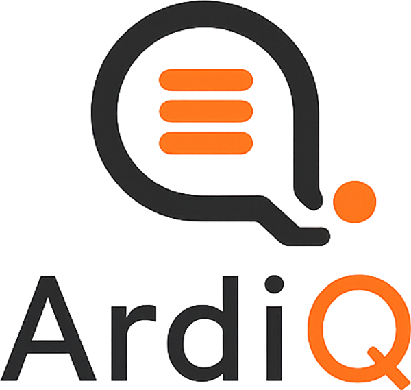

<p align="center">
  <picture>
    <source media="(prefers-color-scheme: dark)" srcset="docs/src/assets/ardiq-logo-dark.png">
    
  </picture>
</p>

<p align="center">
  <a href="https://pypi.org/project/ardiq/"></a>
  <a href="https://pypi.org/project/ardiq/"></a>
  <a href="https://github.com/17tayyy/ardiq/actions/workflows/ci.yml"></a>
  <a href="https://github.com/17tayyy/ardiq/blob/main/LICENSE"></a>
</p>

---

A fast distributed task queue with a **Rust core** and a clean **Python API**, backed by Redis streams.

ArdiQ runs the worker loop and all Redis I/O in Rust (via [PyO3](https://pyo3.rs) + [tokio](https://tokio.rs)); you write tasks in plain Python. The two meet at a single async callback, with the GIL held only for the microseconds it takes to start a task and read its result — so a single process handles high concurrency.

## Features

- 🦀 **Rust core** — the loop and Redis I/O run on tokio, off the GIL
- **Priority queues** — higher-priority tasks are consumed first
- **Delayed & scheduled** tasks (`delay_ms` / `schedule_ms`)
- **Cron & recurring** tasks (`@app.cron`) — 5-field cron (UTC) or `every=` intervals
- **Automatic retries** with quadratic backoff, configurable per task
- **Crash recovery** — in-flight tasks of a dead worker are reclaimed (`XAUTOCLAIM`)
- **Results** with TTL, plus task **status** (`queued` / `running` / `complete` / `not_found`)
- **Sync & async tasks** — blocking sync functions run in a thread pool
- **CLI worker** (`ardiq run module:app`) and **burst mode** (drain the queue and exit)

## Performance

Because the worker loop and every Redis round-trip run in Rust — off the GIL —
ArdiQ delivers **top-tier throughput at a fraction of the memory** of comparable
Python task queues.

Benchmarked head-to-head against arq, Taskiq, Streaq, Celery and Dramatiq on the
same machine (1,000 tasks, one worker, 10 concurrent):

| Queue        | Throughput      | Memory          |
|--------------|-----------------|-----------------|
| **ArdiQ** 🦀 | **top tier**    | **~34 MB** 🪶   |
| Taskiq       | top tier        | ~95 MB          |
| Streaq       | fast            | ~50 MB          |
| arq          | fast            | ~30 MB          |

- 🏆 **Among the fastest** async queues on both CPU- and I/O-bound workloads —
  effectively tied with the leader.
- 🪶 **Lightest in its class** — roughly a third of the memory of the next-fastest
  queue, and the lowest footprint of any queue at its performance level.
- 📈 **Near the theoretical ceiling** on I/O work — practically network-bound,
  with nothing lost to scheduling.
- 🎯 **Rock-steady** — negligible variance run to run.

> Throughput is shaped by hardware and workload, and the GIL caps in-process CPU
> work for *every* Python queue (ArdiQ included). The full, reproducible suite —
> with the honest caveats — lives in the
> [benchmark repo](https://github.com/17tayyy/python-task-queue-benchmarks).

## When to use ArdiQ

**Reach for ArdiQ when you want:**

- **High concurrency on a small footprint** — async-native, with the loop and
  Redis I/O in Rust, so one process does a lot without eating memory.
- **A modern, typed API** — `@app.task`, awaitable enqueue, `Job` handles,
  results and status built in.
- **Reliability out of the box** — priorities, retries with backoff, delayed and
  scheduled tasks, and crash recovery via Redis consumer groups.
- **Redis you already run** — no extra broker to operate.

**Consider the alternatives when:**

- **You need to saturate many CPU cores in one process** — like *every*
  single-process Python queue, ArdiQ runs your task body under the GIL, so
  CPU-bound work is serial per worker (scale out with more workers). For heavy
  CPU fan-out, a prefork model (Celery, Dramatiq) can be simpler.
- **You need a large, battle-tested ecosystem today** — Celery has years of
  integrations, schedulers, and dashboards. ArdiQ is young and moving fast.
- **You can't run Redis** — ArdiQ is Redis-only by design.

ArdiQ sits alongside **arq / Taskiq / Streaq** as a modern async queue — its edge
is the Rust core (memory and per-task overhead) and a batteries-included API.

## Installation

```console
$ pip install ardiq
```

The base install is the library only — a **single runtime dependency** (`msgpack`)
— enough to define tasks, enqueue them, and run a worker from your own code
(`await app.run()`). For the `ardiq` worker command, add the CLI extra:

```console
$ pip install 'ardiq[cli]'
```

You also need a Redis server — the quickest way is Docker:

```console
$ docker run -d --name ardiq-redis -p 6379:6379 redis
```

or install it from your package manager (or [redis.io](https://redis.io)).

> **Building from source** (if you want to hack on ArdiQ itself): you'll need [Rust](https://rustup.rs) and [uv](https://docs.astral.sh/uv/). Clone the repo and run `uv sync`.

## Quickstart

Define an app and some tasks (`example.py`):

```python
from ardiq import Ardiq

app = Ardiq(redis_url="redis://localhost:6379", queue_name="example")


@app.task()
async def add(a: int, b: int) -> int:
    return a + b


@app.task(max_retries=3)
def slow_double(x: int) -> int:   # sync task — runs in a thread
    return x * 2
```

Start a worker:

```console
$ ardiq run example:app
```

Enqueue tasks from anywhere and read their results:

```python
import asyncio
from example import add


async def main():
    job = await add.enqueue(2, 3)        # returns a Job handle
    print(job.id)
    print(await job.status())            # 'queued' | 'running' | 'complete'
    print(await job.result(timeout=5))   # waits → TaskResult(success=True, value=5, tries=1)


asyncio.run(main())
```

Or run the whole thing in one process with `python example.py`, which enqueues a
few tasks and processes them in burst mode.

## Recurring tasks

Register a task to run on a schedule with `@app.cron` — either a standard 5-field
cron expression (evaluated in **UTC**) or a fixed `every=` interval:

```python
@app.cron("0 3 * * *")            # daily at 03:00 UTC
async def nightly_report():
    ...


@app.cron(every=30)               # every 30s — int/float seconds or a timedelta
async def heartbeat():
    ...
```

Recurring tasks fire while a worker is running, and each occurrence is an ordinary
task with its own result, status, retries and timeout. The cron syntax is the
common subset — `*`, lists `,`, ranges `a-b`, and steps `*/n` — at minute
resolution; use `every=` for sub-minute schedules.

## Configuration

`Ardiq(...)` accepts:

| Option | Default | Description |
|---|---|---|
| `redis_url` | `redis://localhost:6379` | Redis connection URL |
| `queue_name` | `"default"` | Logical queue (key namespace) |
| `priorities` | `["default"]` | Priority names, **lowest-first** |
| `concurrency` | `16` | Max tasks running at once |
| `prefetch` | `concurrency * 2` | Max tasks held in memory (drives backpressure) |
| `idle_timeout_ms` | `60000` | When an unrenewed in-flight task may be reclaimed |
| `result_ttl_ms` | `300000` | How long results live (`0` drops, negative keeps forever) |
| `burst` | `False` | Exit once the queue drains |
| `serializer` / `deserializer` | msgpack | Wire codec; pass `pickle.dumps`/`pickle.loads` to send datetimes/objects |
| `cron_poll_s` | `1.0` | How often the worker restages due `@app.cron` occurrences |

`@app.task(...)` accepts `name`, `max_retries` (default 3), `backoff_ms`, `timeout` (seconds), and `priority`.
`@app.cron(spec, *, every=…, …)` takes those same per-task options plus the schedule.
Use `task.options(delay_ms=…, schedule_ms=…, priority=…, task_id=…).enqueue(...)` for one-off overrides.

## Development

```console
$ docker compose up -d      # Redis on localhost:6379
$ uv run pytest             # test suite (needs Redis)
$ uv run ruff check .       # lint
$ uv run ty check ardiq tests   # type-check
```

After changing the Rust core, rebuild with `uv sync --reinstall-package ardiq`.

## License

[MIT](LICENSE)
